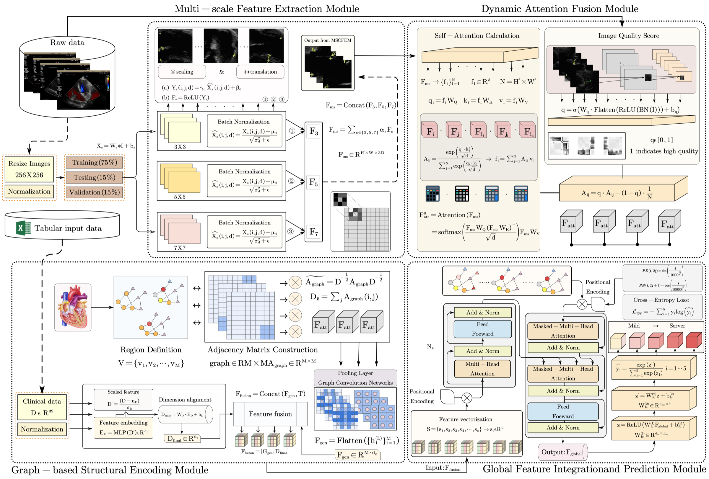
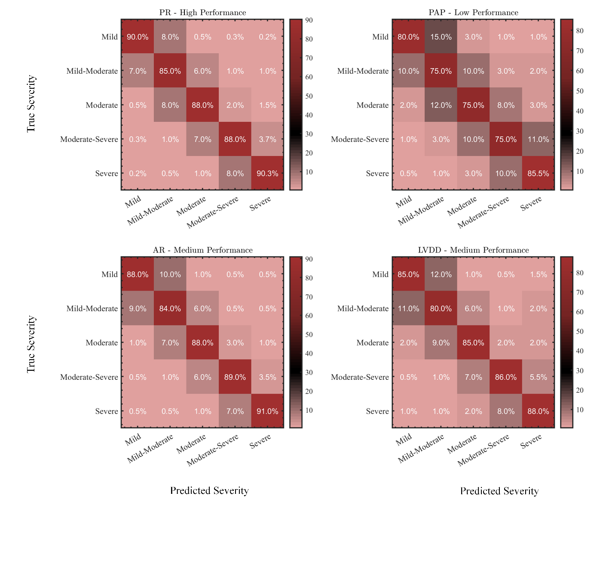

<div align="center">

# AMTDAN

**Adaptive multi-task dynamic attention for cardiac disease severity classification**

[](#)
[](#architecture)
[](#repository-layout)

</div>

AMTDAN combines multi-scale visual encoding, dynamic attention, graph reasoning, and Transformer fusion for five-level severity assessment across 17 cardiac conditions.

## Architecture

<p align="center">
  
</p>

## Results

| Weighted precision | Weighted F1 | AUC | Cohen's κ |
|:---:|:---:|:---:|:---:|
| **90.5 ± 0.4%** | **90.0 ± 0.4%** | **93.8%** | **0.88 ± 0.02** |

<p align="center">
  
</p>

## Repository layout

```text
AMTDAN/
├── assets/                 # architecture and result figures
├── amtdan/
│   ├── datasets/           # validated multimodal and 17-task contracts
│   ├── evaluation/         # ordinal, agreement, and calibration metrics
│   └── models/             # quality-aware missing-modality fusion
├── docs/                   # evaluation, release, and governance protocols
├── tests/                  # executable public-utility test suite
├── pyproject.toml          # dependency-light package metadata
└── README.md
```

> Research preview. Validated schemas, metrics, and fusion utilities are public and tested. The trained AMTDAN architecture, weights, and restricted data are not included in this release.
